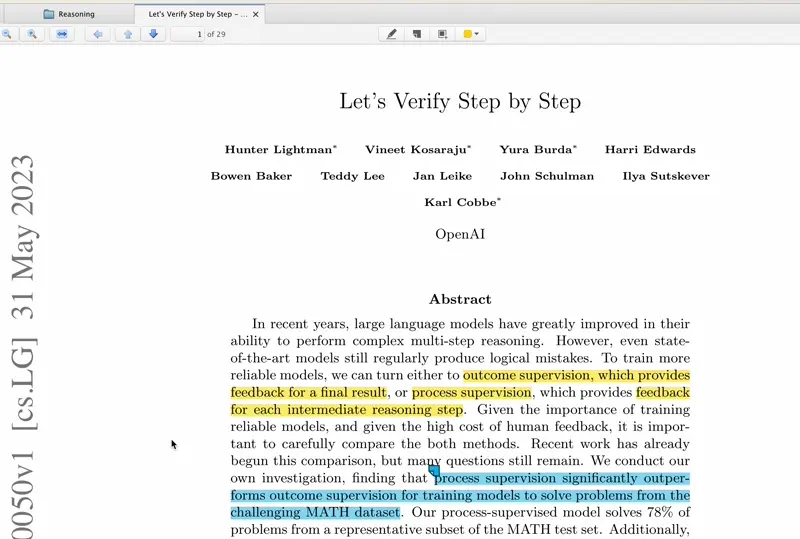

# Open Inline Citation
## CMD-click an inline citation to read it in a new tab




## Installation

1. Download and unzip the [latest release](https://github.com/andrew-healey/open-inline-citation-web/releases).

2. Install unpacked as a Chrome extension.

3. Open a PDF.

4. CMD-click an inline citation to read it in a new tab.

## Building

```sh
gulp chromium
# puts the extension in build/chromium/
```